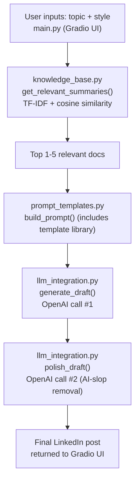

# project_structure.md

## Architecture (renders automatically on GitHub)



## 1. Project identity

- **Project name:** Lenny Buddies
- **Primary project type:** R&D
- **Defined goal:** Generate authentic, brand-differentiated LinkedIn posts from Lenny's Newsletter/Podcast content, grounded in real source material selected by topic relevance.
- **Start / end:** Day 1 morning → Day 3 presentation
- **Why this is a project (tick ≥4):**
  ☑ defined goal ☑ limited resources ☑ interdisciplinary ☑ complex ☑ novel ☑ defined start/end

## 2. Objectives (Quality / Time / Cost)

| Constraint | Objective |
|---|---|
| **Quality** | Every post traceable to real source content, selected by actual topic relevance (not the whole corpus, not arbitrary) — see §7 for what "relevance" means mechanically |
| **Time** | Working end-to-end pipeline (topic → filtered sources → drafted → polished post) by presentation day |
| **Cost** | Shared OpenAI budget across the team; document_processor.py summarization step alone cost 1 API call per article, run once per person's assigned batch |

## 3. Stakeholder analysis

| Role | Interest | Influence | Quadrant | Engagement |
|---|---|---|---|---|
| Content creator / consultant (end user) | H | L | II | Defines what "good" output looks like |
| Instructor (grader) | H | H | I | Reviews rubric-mapped deliverables and live demo |
| Lenny / podcast+newsletter IP source | L | H | III | Non-builder. Shapes attribution handling, no verbatim reproduction |
| LinkedIn audience (readers) | L | L | IV | Content must read as genuine, not AI-generic |

## 4. Requirements → implementation

**Use case:** A content creator picks a topic, and gets back a LinkedIn-ready post grounded in real Lenny's Newsletter/Podcast content relevant to that topic.

**Must have:**

| ID | Must requirement | Maps to (file/module) | Status |
|---|---|---|---|
| M1 | Ingest primary KB markdown | `src/document_processor.py` → `knowledge_base/processed/processed_documents.json` | ✅ Done — per-person batches summarized, merged by Zahra |
| M2 | Call LLM with KB context | `src/llm_integration.py` (`generate_draft`, via `build_prompt`) | ✅ Done |
| M3 | Reusable prompt templates (≥2) | `templates/prompt_templates.json` (4 templates) + `src/prompt_templates.py` | ✅ Done — exceeds the ≥2 minimum |
| M4 | End-to-end pipeline command | `src/main.py` (Gradio) → `llm_integration.generate_post_from_inputs()` | ✅ Done |
| M5 | RAG decision documented | `rag_decision.md` | ✅ Being finalized by Mudit |
| M6 | Project structured + agents guided | `project_structure.md` (this file), `agents.md` | ✅ `agents.md` exists and is substantive; this file now current |

**Won't have this sprint:**

| Won't | Why deferred |
|---|---|
| Full vector RAG / embeddings + vector store | TF-IDF cosine similarity (see §7) covers relevance-based retrieval without that complexity |
| Automated LinkedIn publishing | Manual copy-paste from the Gradio output is sufficient for MVP |
| Full monitor/brief/iterate pipeline stages | MVP scope is filter → generate; optional stages not built |

## 5. WBS — final status

```
1. Structure & board                                    [done]
2. Knowledge bases
   2.1 Primary: per-person markdown batches              [done]
3. Ingest & context
   3.1 document_processor.py (markdown → summarized JSON)[done]
   3.2 knowledge_base.py (TF-IDF relevance filtering)     [done]
4. Generate & differentiate
   4.1 llm_integration.py + .env                          [done]
   4.2 prompt_templates.py + 4 templates                  [done]
   4.3 main.py end-to-end Gradio pipeline                 [done]
5. Close
   5.1 rag_decision.md                                    [done]
   5.2 README + demo prep                                 [done]
   5.3 Day 1/2/3 board screenshots                         [done]
```

## 6. Risks (exactly 3)

| Risk | P | I | Strategy | Concrete action taken |
|---|---|---|---|---|
| Shared API budget running out mid-project | H (materialized) | M | Mitigation | When one member's key hit its limit, another member ran their batch using their own key as a one-time favor |
| Real KB schema changing mid-development (field names, `tags` semantics) | H (materialized) | M | Reduction | Kept `document_processor.py`/`knowledge_base.py`/`prompt_templates.py`/`llm_integration.py` strictly separated by responsibility, so schema changes only ever required editing one file at a time, never a cascading rewrite |
| Output reading as generic "AI-slop," not real grounded content | M | H | Reduction | Two-step generation: draft, then a dedicated editing/polish pass (Mudit's editing-principles spec) run as a second LLM call before returning the final post |

## 7. Bridge to rag_decision.md

We chose **non-RAG**: our knowledge base is a small, static set of pre-summarized documents (~60), so instead of a full retrieval/embeddings pipeline, we use lightweight TF-IDF keyword matching to select the 1-5 most relevant documents before injecting them into the prompt. This kept the pipeline simple, fast, and cost-effective without needing a vector database.
